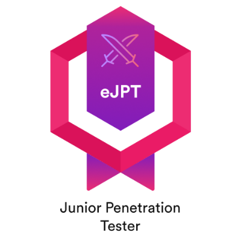
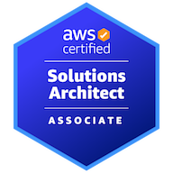
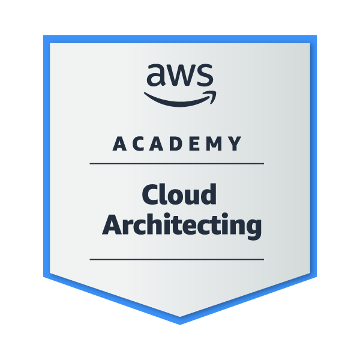
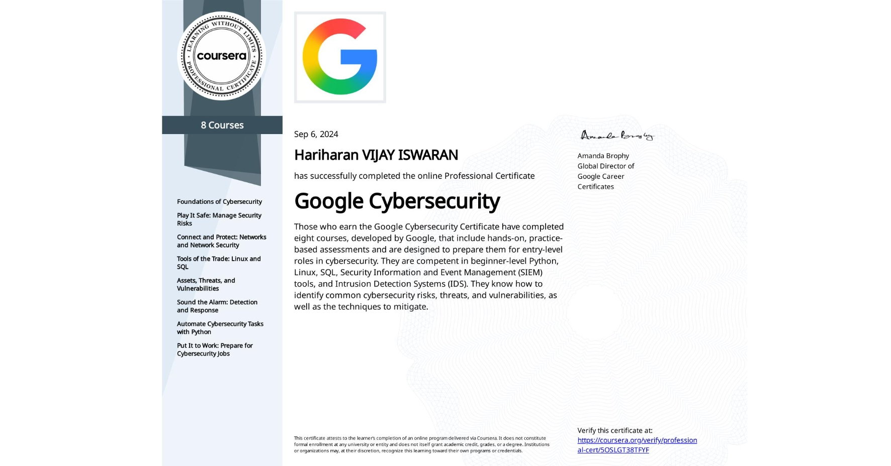

<h1 align="center">Hi, I'm Hariharan Vijay Iswaran 👋</h1>
<h3 align="center">Aspiring Pentester (Web & AD) | M.S. Cybersecurity Graduate</h3>

  
  
  

  

---

### 🧠 About Me
I'm currently interning as a **Security Engineer**, and previously worked as a **Technical Linux Specialist** with University IT support.
Currently focused on offensive security — hacking into systems, networks, web apps, and Active Directory (ethically), finding real weaknesses and helping develop defense mechanisms before they become real breaches.

🔭 Currently working toward **OSCP**
🌱 Also exploring KLCP and OSWP as part of a broader certification roadmap
💬 Open to Penetration Tester and Security Engineer roles
📫 Reach out via [LinkedIn](https://www.linkedin.com/in/hariharan-vijay-iswaran-/)

---

### 🛠️ Skills

**Detection & Monitoring**
 
-005571?style=flat-square&logo=elasticsearch&logoColor=white)

**Network & Protocols**
 

**Security Tools**
 

**Systems & Infrastructure**
 

**Scripting & Programming**
 

---

### 💼 Experience

**Technical Linux Specialist** — University of North Carolina at Charlotte *(Oct 2025 – May 2026)*
- Led migration of 100+ workstations off EOL Linux versions and hardened the fleet to security standards
- Monitored AWX/Ansible deployments, diagnosing and resolving failed installs, maintaining a reliable secure-imaging pipeline
- Managed identity & access control (Grouper) across 100+ reimaged/onboarded workstations
- Audited and decommissioned 25+ unmanaged workstations, reducing unmonitored endpoint exposure
- Delivered Tier 1/2 support on-site and remotely, resolving 15+ tickets weekly
---

### 🎓 Education

  &nbsp;&nbsp;
  <b>M.S. Cybersecurity</b> — University of North Carolina at Charlotte <i>(Aug 2024 – May 2026)</i>, GPA 3.90/4.00

  &nbsp;&nbsp;
  <b>B.Tech, Information Technology</b> — SRM IST Chennai <i>(Sep 2020 – May 2024)</i>, GPA 8.97/10.00

---

### 📜 Licenses & Certifications

  
  
  
  

| Certification | Issuer | Issued |
|---|---|---|
| eJPTv2 (Junior Penetration Tester) | INE Security | Feb 2026 |
| AWS Certified Solutions Architect – Associate | AWS | Dec 2024 |
| AWS Academy Cloud Architecting | AWS | Dec 2024 |
| Google Cybersecurity Specialization | Google Career Certificates | Sep 2024 |

---

### 📈 GitHub Stats

  
  

---

<i>Thanks for stopping by — always happy to connect with fellow cybersecurity folks and recruiters!</i>

